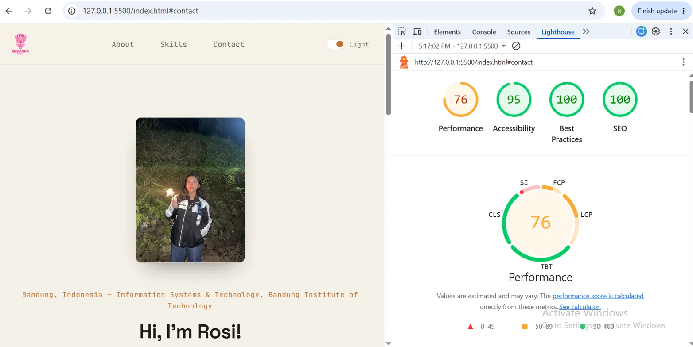
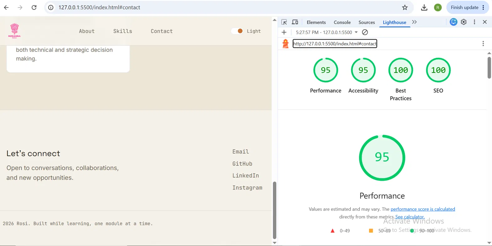

# Rosi — Personal Landing Page

Personal portfolio homepage skeleton for GDGOC ITB Module 1 hands-on task.
Built with plain HTML5 and CSS (no frameworks).

## Structure

```
.
├── assets/
│   ├── lighthouse-after.png
│   ├── lighthouse-before.png
│   ├── logo-dark.png   
│   ├── logo-light.png   
│   └── profile.jpg      
├── index.html            
├── styles.css             
└── README.md
```

## Features

- **Semantic HTML5**: `<header>`, `<nav>`, `<main>`, `<section>`, `<article>`, `<footer>`
- **Layout**: Flexbox for the header/hero/footer rows, CSS Grid for the skills section
- **Responsive**: breakpoints at 860px and 640px, tested down to mobile widths
- **Theme-aware logo**: swaps between a light and dark mark depending on the active theme
- **Bonus 1 — CSS variables + dark/light mode**: all colors are defined as custom
  properties in `:root`, overridden inside `body.light-mode`. Toggle button in the
  header swaps the class and persists the choice in `localStorage`.
- **Bonus 2 — Animation**: hero content fades/slides in on load (staggered), the
  nav links get an underline slide on hover, skill cards lift on hover, and the
  hero cursor blinks via `@keyframes`.
- **Bonus 3 — Lighthouse audit**: see below.

## Running locally

No build step needed — just open `index.html` in a browser, or serve it locally:

```bash
python3 -m http.server 5500
# then visit http://localhost:5500
```

## Lighthouse audit (Bonus 3)

Run this yourself once the site is live (e.g. via GitHub Pages) or served locally:

1. Open the page in Chrome.
2. Open DevTools (`F12` or `Ctrl+Shift+I`) → **Lighthouse** tab.
3. Select **Performance** and **Accessibility**, device: Mobile, then **Analyze page load**.
4. Record the "before" scores here, then optimize (for example compress/self-host fonts,
   add explicit image dimensions, double-check color contrast) and re-run for "after".
5. Paste both screenshots below.

**Before:**


**After:**


## Git workflow / commit history

This project was committed in the following sequence:

1. `feat: add semantic HTML structure for landing page` — initial `index.html`
2. `style: add layout, theming, and animations with CSS` — initial `styles.css`
3. `docs: add project README with setup and audit instructions` — `README.md`
4. `feat: revise hero layout, copy, and logo integration` — revised
   `index.html` and `styles.css`, added `assets/profile.jpg`,
   `assets/logo-dark.png`, and `assets/logo-light.png`

```bash
git init
git add index.html
git commit -m "feat: add semantic HTML structure for landing page"

git add styles.css
git commit -m "style: add layout, theming, and animations with CSS"

git add README.md
git commit -m "docs: add project README with setup and audit instructions"

git add .
git commit -m "feat: revise hero layout, copy, and logo integration"

git add .
git commit -m "perf: resize images to display size and optimize font loading"

git add README.md
git commit -m "docs: add Lighthouse audit before/after screenshots"

git branch -M main
git remote add origin https://github.com/rosianna-maria/Portfolio-Landing-Page.git
git push -u origin main
```

## Roadmap

This landing page is the skeleton for a full portfolio site, to be expanded
module by module with a projects section, blog/writeups, and a resume page.